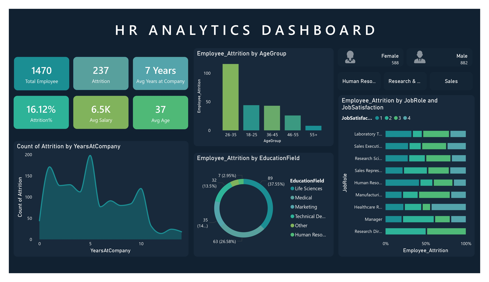

# 📊 HR Analytics Dashboard  

An interactive HR Analytics Dashboard built with **Power BI** to explore employee attrition and workforce insights.  
This project aims to help HR teams identify attrition trends, understand key influencing factors, and support data-driven decision making for employee retention strategies.  

## 🔍 Project Overview  
- **Objective:** Analyze employee attrition and uncover factors contributing to workforce turnover.  
- **Tools Used:** Power BI (data cleaning, DAX, interactive visualization).  
- **Dataset:** HR employee dataset (includes employee demographics, tenure, salary, education field, and job roles).  

## 📈 Key Features  
- Overall HR metrics: total employees, attrition count, attrition rate, average salary, average age, average tenure.  
- Attrition analysis by:  
  - Age group  
  - Years at company  
  - Education field  
  - Job role and job satisfaction  
- Interactive filters for gender and department.  
- Visual insights that highlight high-risk groups.  

## 💡 Insights from Dashboard  
- Overall attrition rate: **16.12%** out of 1,470 employees.  
- Employees aged **26–35** show the highest attrition.  
- Attrition is most common in **Life Sciences** and **Medical** backgrounds.  
- Job roles such as **Sales Executive**, **Sales Representative**, and **Research Scientist** show notable attrition linked to job satisfaction.  

## 🖼️ Dashboard Preview  
 
